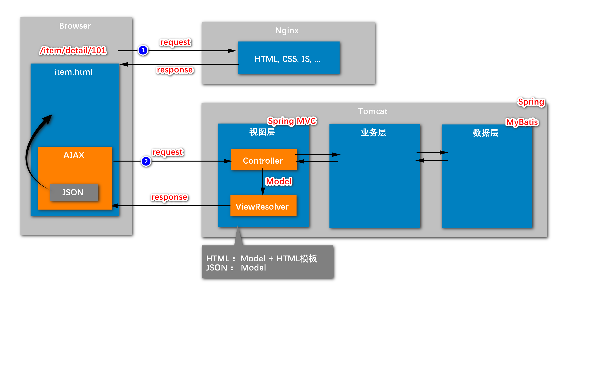
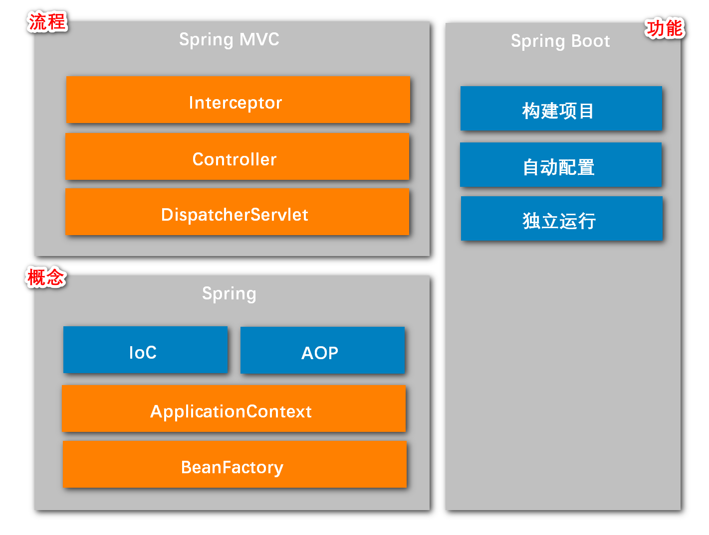
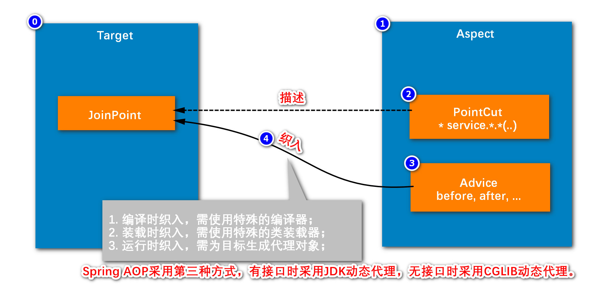

应用服务器是部署在Tomcat 中的。 服务端代码做分层处理 --- 服务端三层结构： 视图层（表现层）， 业务层， 数据访问层 

数据访问层框架： MyBatis， 

视图层： Spring MVC

MVC模式是什么： 是三个核心组件， 相互配合。 不是服务器三层代码结构。 Spring MVC解决的是视图层的问题。

Spring MVC用来与前端页面进行交互， 要解析请求， 返回所需数据。 其中解析请求中的数据的是Controller组件。 返回相应结果的是View组件，

Controller解析request的参数后，交由业务层进行请求的功能进行处理。 而对数据库的访问则由业务层调用数据层完成。

业务层返回给Controller的只是数据， 不满足用户想要的信息模式（html， Json, 图片等）， 返回用户的是viewResolver， 不同的Resolver返回不同的形式。 Controller把数据用Model封装，传给View,Resolver, View负责返回给用户最终的信息。

Spring解决的是整个服务端代码当中， 那些核心的对象（bean）的管理问题。降低耦合，实现可插拔。 因为对象之间有联系。 

前后端分离， 前端服务器与后端服务器分离。 使用AJAX发请求访问后端服务器得到数据，异步处理数据，渲染页面。

浏览器发送两次请求，第一次发给前端的额Nginx， 得到静态资源，然后发送异步请求，获取动态数据，在页面的局部进行渲染。

Spring 有两个核心功能： IoC, AOP， 这两个功能依赖于核心组件ApplicationContext， BeanFactory。

IoC和AOP都是以来ApplicationContext和BeanFactory的， BeanFactory一般是支持框架内部的， ApplicationContext是针对应用开发层面的， ApplicationContext继承自BeanFactory。

SpringMVC是基于Spring的。 核心组件 DispatcherServlet， Controller,  Interceptor。 

SpirngMVC的工作流程。

SpringBoot 核心功能： 快速构建项目（为什么）， 自动配置， 独立运行（内嵌Tomcat）， 还有项目监控功能。

SpringBoot是一个工具， 帮助快速开发spring项目

## 整体框架：

spring boot 项目开始运行时的步骤

项目会自动生成一个运行入口类。 带有注解@SpringBootApplication （这是一个多种注解的集合）（@SpringBootConfiguration, 指明这是配置类， @EnableAutoConfiguration, 启动自动配置， @ComponentScan, 扫描配置类同级和下级包下的bean， 扫描带有@Component 通用组件, @Repository DAO层组件, @Service 服务层组件, @Controller 注解的类）

开始运行时，会加载配置文件 resources下的application.properties，读取参数

然后启动Tomcat。（配置文件中可以指定Tomcat的访问路径，所以后启动）

创建spring容器

自动扫描bean并将其装配到容器里。（扫描所有包中带有注解的类并放入容器中）

## Spring Boot: 

SpringBoot 核心功能： 快速构建项目（为什么）， 自动配置， 独立运行（内嵌Tomcat）， 还有项目监控功能。

SpringBoot是一个工具， 帮助快速开发spring项目

## IOC :

IoC: 控制反转 （帮助程序员管理对象，管理bean之间的关系，降低耦合实现可插拔，可以方便的更换已实现的功能bean）

业务层--加@Service

数据访问层代码--加@Repository

视图层--加@Controller

注解的功能完全一样，只有语义不同

所有对象通过spring的容器去管理，在需要使用到的地方通过@Autowired进行注入

频繁发生变化，需要有很多实例的类，一般就不用ioc管理

controller中进行路径映射@RequestMapping(paht = "") controller 一般不写接口，因为他接收前端请求

IoC 不仅能注入bean，还能管理bean的生命周期

@PostConstruct， 在容器实例化后立即调用该方法；@PreDestroy， 在资源回收前立即调用该方法

@Scope("singleton/prototype") ，管理bean的作用域， 一般情况service都是单例，多例用的很少（拆成单例）

IoC和AOP都是以来ApplicationContext和BeanFactory的， BeanFactory一般是支持框架内部的， ApplicationContext是针对应用开发层面的， ApplicationContext继承自BeanFactory

如果不适用spring 的自动容器注入，那么也可以通过ApplicationContext把想使用的bean提取出来： applicationContext.getBean()， 可以通过 类型/类名 等来获取bean。 通过类名获取到的是个object对象，需要强制类型转换。

ApplicationContext的核心功能就是获取bean. 

## AOP:

面向切面编程 （面向方便编程）， 能够解决公共需求，以可插拔的方式。

aop包不是spring 原生的，需要在pom.cml中配置一下依赖。

@Aspect表示这是一个aop组件

#### aop在干什么：

target：需要对哪些组件进行处理

JoinPoint：哪些方法是要处理的

第一步，新建一个类（aspect，切面），标识上@Aspect，表示这是一个aop组件，能影响很多个类

第二步， 用PointCut（切点）注解标注哪些方法是要影响的

第三步，确定行为发生的时机

第四步， 织入 （底层执行的其实是一个插入了aop的目标类的子类）

aop用的比较少

当很多bean都有共同的需求功能时，就可以考虑使用aop, 但是这些统一功能（如日志，事务）都被其他的实现了

## Spring MVC: 

servlet是Java 的web开发的一个标准，开发一个servlet后要注册给tomcat, 由tomcat去调用。

前端发送的所有请求在spring mvc中都是交由dispatcherServlet统一处理。 

DispatcherServlet要解析路径，判断使用哪一个组件进行处理。这一步要使用HandlerMapping组件。 

HandlerMapping 扫描并存储带有@Controller的bean，DispathcerSerlet询问HandlerMapping查找对应请求要使用的组件.

HandlerAdapter持有Controller， DispatcherServlet通过它去调用Controller。Controller返回的是ModelAndView(html模式)。

之后，使用ViewResolver将ModelAndView合成html, 用view组件进行封装。

用view组件向前台进行相应。

当返回的不是html而是json时，不需要调用ViewResolver，而是由HandlerAdapter直接处理，直接向前台做相应（在Controller方法加了@ResponseBody注解时）（因为MAV为空，不调用ViewResolver）。

拦截器interceptor，

去看一下关键步骤的代码

## MyBatis:

maven 依赖： <groupId>org.mybatis.spring.boot</groupId>   <artifactId>mybatis-spring-boot-starter</artifactId>

MyBatis要访问数据库， 要依赖MySql的驱动，所以也需要MySql的依赖项

使用连接池，复用连接，提高效率。 跟jdbc那种自己创建连接不同。

要使用连接池，必须传入数据库的连接参数，才能创建连接。

连接池要配置 驱动类， mysql 的url， 账号密码， 还要指定连接池核心类（type）

配置mybatis插件，mybatis-generate-config.xml， 可以在配置后自动生成代码。（使用命令行启动插件）

会自动生成一个接口以及各种基本sql方法，对应于配置文件

底层是动态代理生成实现类，不需要自己写代码。

生成的接口要加@Mapper，让spring管理

MyBatis核心组件： 

SqlSessionFactory,  Sqlsession相当于数据库的连接，所有的对数据库的操作都要通过其实现，而SqlSession是通过SqlSessionFactory创建的。（SqlSession依赖于SqlSessionFactory）。

SqlSession底层封装的是真正的数据库连接（connection）， 创建连接的时候需要能够访问到datasource以将其封装，这需要从配置类中获取(Configuration)， 配置类的信息是从配置文件Application.properties加载而来。

Mapper接口是程序员要自己编写的，对应的配置文件Mapper.xml， 一个表就要有一个配置文件和一个对应的Mapper接口。Mapper接口的实现类是在运行的时候由MyBatis动态创建的（动态代理机制）。这个动态代理机制是由MapperProxy创建的。

MapperProxy在执行的时候需要获取（依赖）SqlSession实现增删改查。

SqlSession和factory是自动配置的，这个自动配置类是MyBatisAutoConfituration，在程序启动时会自动 初始化，创建SqlSessionFactory, 而SqlSessionFactory想要创建SqlSession, 需要读取配置类Configuration获取数据源连接信息， 而这个配置类读取自application.properties。 配置类也会读取Mapper.xml。

MapperScannerConfigurer用来扫描Mapper， 生成对应的MapperProxy。 而这个步骤是通过MyBatisAutoConfiguration驱动的。

MapperProxy